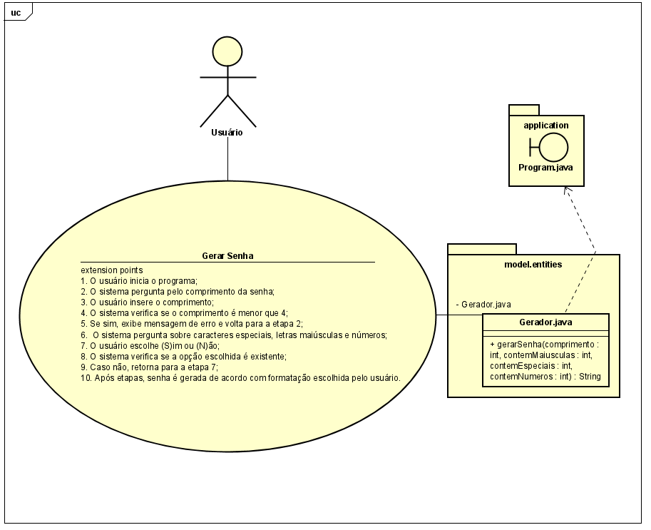

# Gerador de Senhas

Bem-vindo ao Gerador de Senhas! Este é um programa Java que permite aos usuários gerarem senhas personalizadas com base em suas preferências.

## Como Usar

1. Baixe ou clone este repositório para o seu computador.
2. Abra o projeto em uma IDE Java de sua escolha.
3. Navegue até a classe `Program.java` em `src/application`.
4. Execute a classe `Program` para iniciar o programa.

Ao executar o programa, siga as instruções apresentadas no console:

1. Digite o comprimento desejado para a senha (mínimo 4 caracteres).
2. Responda às perguntas sobre a inclusão de caracteres especiais, letras maiúsculas e números na senha.

O programa irá gerar uma senha baseada nas suas escolhas e exibirá a senha gerada no console.

## Estrutura do Projeto

O projeto é composto por duas classes principais:

- `Program.java`: Esta é a classe que contém o método `main` e interage com o usuário. Ela recebe as entradas do usuário e coordena a geração da senha.
- `Gerador.java`: Esta classe contém a lógica para gerar senhas aleatórias com base nas preferências do usuário. Ela possui um método `gerarSenha` que aceita parâmetros para o comprimento da senha e as opções de inclusão de caracteres especiais, letras maiúsculas e números.

## Requisitos

- Java Development Kit (JDK) instalado.
- IDE Java (recomendado) ou compilador Java para execução do programa.

## Contribuição

Este projeto é de código aberto e você é bem-vindo(a) a contribuir. Sinta-se à vontade para fazer um fork do repositório, fazer melhorias e enviar um pull request.

## Sobre o Projeto

Neste projeto, utilizei minhas habilidades em programação Java e modelagem de software para criar um gerador de senhas que permite aos usuários definirem o comprimento da senha e escolherem se desejam incluir letras maiúsculas, caracteres especiais e números.

## Tecnologias e Habilidades Demonstradas

- **Linguagem de Programação Java:** A estrutura principal do programa foi desenvolvida em Java.

- **Modelagem com Astah:** Utilizei a ferramenta Astah para criar um diagrama de caso de uso que ilustra as interações do usuário com o sistema. 

- **Validação de Entradas:** Implementei validações para garantir que o comprimento da senha atenda aos requisitos mínimos e que as opções escolhidas pelo usuário sejam consideradas na geração da senha.

- **Geração de Senhas Aleatórias:** Utilizei a classe `SecureRandom` para criar um algoritmo que gera senhas aleatórias de acordo com as preferências do usuário.

- **Tratamento de Exceções:** Implementei tratamento de exceções para lidar com possíveis erros de entrada do usuário, proporcionando uma experiência mais amigável.

- **Versionamento no GitHub:** Hospedei o projeto no GitHub para demonstrar meu conhecimento em controle de versão, colaboração em equipe e compartilhamento de código.

Fique à vontade para explorar o código-fonte e experimentar o gerador de senhas. Sinta-se à vontade para entrar em contato comigo para qualquer dúvida ou sugestão!

---

Feito com ❤️ por Ygor Goes | [https://www.linkedin.com/in/ygor-goes-8649b9193/]
